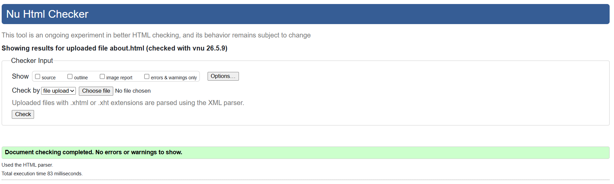

## Table of Contents

- [Testing and Validation](#testing-and-validation)
- [CSS Validation](#css-validation)
- [HTML Validation](#html-validation)
- [JavaScript Validation](#javascript-validation)
- [Lighthouse Validation](#lighthouse-validation)
  - [Lighthouse Score Reference](#lighthouse-score-reference)
- [Lighthouse Results Summary](#lighthouse-results-summary)
  - [Home Page](#home-page)
  - [About Page](#about-page)
  - [Locations Page](#locations-page)
  - [Menu Page](#menu-page)
  - [Tavern Code & FAQ Page](#tavern-code--faq-page)
  - [Gallery Page](#gallery-page)
  - [Contact Page](#contact-page)
  - [Feedback / Message Received Page](#feedback--message-received-page)
  - [Under Construction Page](#under-construction-page)
- [Performance Considerations and Impact](#performance-considerations-and-impact)
- [Conclusion](#conclusion)

# Testing and Validation

This document outlines the testing and validation processes carried out for *The Wayfarer’s Rest* project. These include HTML, CSS, and JavaScript validation, as well as performance, accessibility, best practices, and SEO testing using Lighthouse.

---

## CSS Validation

CSS validation was conducted using the **W3C CSS Validation Service** to ensure the stylesheet complies with current CSS standards. The project’s main stylesheet validated successfully with no errors found, confirming that the CSS is written correctly and follows best practices.

**CSS Validation Result:**
- *No errors found*

---

## HTML Validation

HTML validation was carried out using the **W3C Nu HTML Checker**. Every HTML page in the project was individually tested and returned no errors or warnings.

As all pages produced identical clean results, one representative validation result (the home page) is shown below to avoid unnecessary repetition.

**HTML Validation Result:**
- *No errors or warnings*

---

## JavaScript Validation

JavaScript was validated using **JSHint** and passed with no errors.

---

## Lighthouse Validation

Performance, Accessibility, Best Practices, and SEO testing was conducted using **Google Lighthouse** within Chrome DevTools. Testing was performed on the deployed site in both **desktop and mobile** modes to reflect real‑world usage.

### Lighthouse Score Reference

| Category | Score Range | Indicator | Explanation |
|--------|------------|-----------|-------------|
| Performance | 90–100 | 🟢 | Fast loading and efficient runtime performance |
| Performance | 50–89 | 🟠 | Moderate performance with room for improvement |
| Performance | 0–49 | 🔴 | Poor performance, likely due to heavy assets |
| Accessibility | 90–100 | 🟢 | Content accessible to most users |
| Best Practices | 90–100 | 🟢 | Follows modern, secure web standards |
| SEO | 90–100 | 🟢 | Strong search‑engine visibility |

---

## Lighthouse Results Summary

### Home Page
- Desktop: Performance 74, Accessibility 95, Best Practices 100, SEO 100
- Mobile: Performance 69, Accessibility 91, Best Practices 100, SEO 100

---

### About Page
- Desktop: Performance 80, Accessibility 95, Best Practices 100, SEO 100
- Mobile: Performance 69, Accessibility 95, Best Practices 100, SEO 100

---

### Locations Page
- Desktop: Performance 62, Accessibility 95, Best Practices 100, SEO 100
- Mobile: Performance 68, Accessibility 95, Best Practices 100, SEO 100

---

### Menu Page
- Desktop: Performance 94, Accessibility 95, Best Practices 100, SEO 100
- Mobile: Performance 71, Accessibility 95, Best Practices 100, SEO 100

---

### Tavern Code & FAQ Page
- Desktop: Performance 99, Accessibility 95, Best Practices 100, SEO 100
- Mobile: Performance 85, Accessibility 95, Best Practices 100, SEO 100

---

### Gallery Page
- Desktop: Performance 82, Accessibility 95, Best Practices 100, SEO 100
- Mobile: Performance 52, Accessibility 95, Best Practices 100, SEO 100

---

### Contact Page
- Desktop: Performance 99, Accessibility 96, Best Practices 100, SEO 100
- Mobile: Performance 87, Accessibility 96, Best Practices 100, SEO 100

---

### Feedback / Message Received Page
- Desktop: Performance 98, Accessibility 95, Best Practices 100, SEO 100
- Mobile: Performance 69, Accessibility 95, Best Practices 100, SEO 100

---

### Under Construction Page
- Desktop: Performance 99, Accessibility 95, Best Practices 100, SEO 100
- Mobile: Performance 69, Accessibility 95, Best Practices 100, SEO 100

---

## Performance Considerations and Impact

While most pages achieved strong performance scores, some pages recorded lower results, particularly during mobile Lighthouse testing. These outcomes are expected and reflect deliberate design and content decisions rather than implementation issues.

- **Image‑heavy content:** Pages such as the Home, Gallery, and Locations pages rely on large, high‑quality images to support visual storytelling and immersion. Lighthouse performance scoring penalises large image assets, especially on mobile where network and CPU throttling are applied.

- **Simulated mobile throttling:** Lighthouse mobile audits intentionally simulate slower network connections and reduced processing power. This results in consistently lower mobile performance scores when compared to desktop, particularly on visually rich pages.

- **Multiple assets loading simultaneously:** Gallery and map‑based pages load several images during initial render. While this enhances visual impact and user experience, it increases load time and negatively affects performance metrics.

- **Client‑side interactivity:** Interactive features such as carousels, accordions, scroll‑reveal animations, and JavaScript‑driven map pop‑ups add runtime overhead. These features prioritise engagement and usability over raw performance scores.

- **No advanced optimisation pipeline:** As this is an educational front‑end project, no build tools, image compression pipelines, or CDN services were implemented. Advanced optimisations such as WebP image conversion or aggressive lazy loading represent potential future improvements rather than current requirements.

Despite performance variation on certain pages, **Accessibility, Best Practices, and SEO scores remained consistently high across the entire site**, indicating well‑structured markup, accessible design, and adherence to modern web standards.

---

## Conclusion

All validation and testing tools returned successful results, demonstrating that *The Wayfarer’s Rest* meets modern web standards for structure, styling, accessibility, and search‑engine optimisation. Performance variations are consistent with the project’s visual and interactive design goals and have been correctly identified and documented.